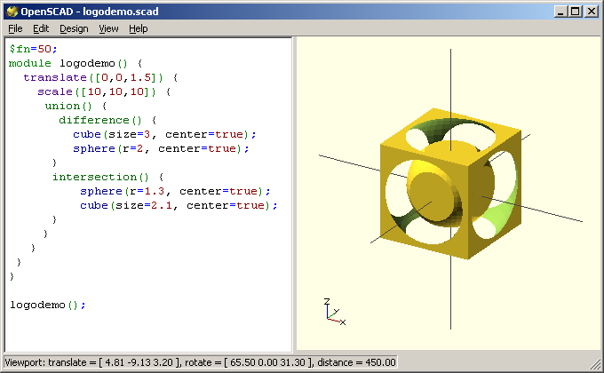
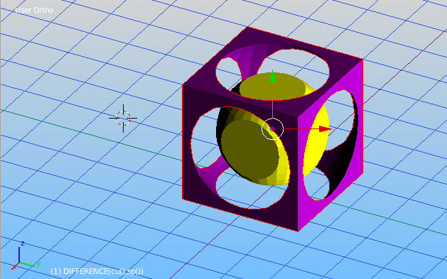

BlenderSCAD - bridging the gap between Blender and OpenSCAD
===========

Blender is a powerful piece of Open Source software which is also useful in the 3D printing space.
Coming from OpenSCAD or Tinkercad, there are some issues at the first glance:

<ul>
<li>Revisiting and changing a model seems to be difficult - Joining meshes is less attractive than grouping/ungrouping objects
<li>Undo functionality is not that advanced.
<li>The parametric approach of OpenSCAD is very powerful and yet easy to learn. Blender's Python console is something you may not even be aware of.
<li>Blender's UI is way too dark to provide this warm and welcome feeling of Tinkercad or OpenSCAD :-)
</ul>
 
This is currently rather a proof of concept implementation as I'm just familiarizing myself with Blender and Python.
 
However, my results are encouraging enough to share them:

<h3> OpenSCAD code</h3>
Btw: It's the OpenJSCAD logo

<pre>
module logodemo() {
  scale([10,10,10]) {  
    translate([0,0,1.5]) {
     union() {
       difference() {
         cube(size=3, center=true);
         sphere(r=2, center=true);
      }
      intersection() {
          sphere(r=1.3, center=true);
          cube(size=2.1, center=true);
      }
	 }
   }
  }
}
logodemo();
</pre>

<h3>Translated to BlenderSCAD</h3>
...with added some color and treated as two grouped objects
<pre>
def logodemo():  
	scale([10,10,10], 
	   translate([0,0,1.5] 
		 , group(   
			 color(purple, difference(
				 cube([3,3,3], center=true)
			   , sphere(r=2, center=true)
			 ))
		   , color(yellow, intersection(
				 sphere(r=1.3, center=true)
			   , cube([2.1,2.1,2.1], center=true)
		   ))	  
		 )
	 )
	)

logodemo()
</pre>

<h2>Instructions</h2>
Have Blender 2.69 installed. SAVE all open work first, better go to a clean document.
Run the BlenderSCAD file and uncomment the demo section you want to try out.
For the moment, this is the easiest way. Can also be saved as part of a .blend file.
Again, caution, the upper part of the script will first wipe all objects of the open scene.

There are two ways to execute the script in Blender:

<h4>via Blender's built in text editor</h4>

This way, Blender is your OpenSCAD-like IDE. You can even have the code compile while typing
(Check "Live Edit" in the editor)
Load <i>"BlenderSCAD.py"</i> into your text editor.

<h4>via Python Console</h4>

<pre>
#Optionally, first clear command history in Python Console:
bpy.ops.console.clear(history=True)
filename = "<your path>/BlenderSCAD.py
exec(compile(open(filename).read(), filename, 'exec'))
</pre>

The second option is preferred if you use an external editor for the code.

<h4>Recent Update:</h4>
As the BlenderSCAD.py script was meanwhile growing too much, I've split the project into a python module <i>blenderscad</i> 
and a demo script <i>blenderscad_demo.py</i>.
You can either set a path in the demo script to the folder containing the blenderscad directory or place it where Blender's module path:
<pre>
[installpath]\blender-2.69\2.69\scripts\modules\blenderscad
</pre>
 
The old BlenderSCAD.py file will remain in place, but won't be longer maintained. Might be handy for some tests (e.g. on mobile devices?)

<h4>UI Look and Feel</h4>
You can use my <b>startup.blend</b> and <b>userpref.blend</b> files from the config subfolder optionally.
These will provide my Blender Theme adjustments and screen area setup as shown in the screenshot above.
Place the content of the "config" folder into the Blender's config folder:
<pre>
%USERPROFILE%\AppData\Roaming\Blender Foundation\Blender\2.69\config
</pre>
if you are using Windows (Otherwise, refer to the Blender documentation).

Blender files usually grow with all unlinked objects. It will garbage clean whenever you save and reopen the document.
In order to make the "Live Edit" option work reasonable, I explicitly force the deletion of intermediate objects (e.g. before union).
Therefore, the files should stay cleaner than while editing a blender file in the usual way.
 
A last word of "warning": Pay attention to where your source file is saved.
<i>ALT+S</i> will save the file in the editor, <i>CTRL+S</i> will save the "materialized" version of that file inside blender. Changes may be lost if you resync.

<h3>Supported so far</h3>
<ul>
<li>cube
<li>cylinder
<li>sphere
<li>circle
<li>square
<li>polygon
<li>polyhedron
<li>
<li>translate
<li>rotate
<li>mirror
<li>scale
<li>resize
<li>color
<li>
<li>union
<li>difference
<li>intersection
<li>
<li>
<li>*linear_extrude
<li>rotate_extrude
<li>hull
<li>
<li>import_stl
<li>*export_stl
<li>
<li>hexagon
<li>octagon
<li>ellipsoid
<li>rcube
<li>roundedBox
<li>
<li>fn ($fn)
<li>string functions: echo, str, *search
<li>math functions: lookup, rands, sign, sin , cos,...
</ul>

<h3>Extras</h3>
<ul>
<li>join
<li>group
<li>round_edges
<li>
<li>+several demos
<li>...
</ul>

<h3>Missing</h3>
<ul>
<li>minkowski
<li>projection
<li>norm
<li>multimatrix
<li>...
</ul>
