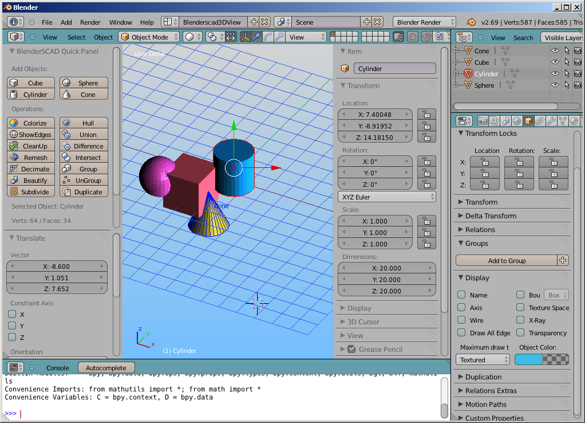
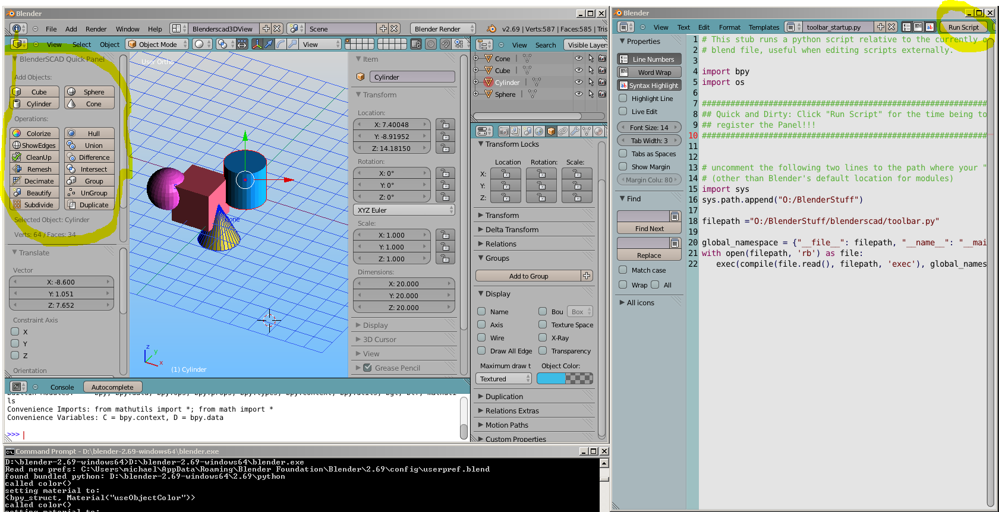

BlenderSCAD - bridging the gap between Blender and OpenSCAD
===========

Blender is a powerful piece of Open Source software which is also useful in the 3D printing space.
Coming from OpenSCAD or Tinkercad, there are some issues at the first glance:

<ul>
<li>Revisiting and changing a model seems to be difficult - Joining meshes is less attractive than grouping/ungrouping objects
<li>Undo functionality is not that advanced.
<li>The parametric approach of OpenSCAD is very powerful and yet easy to learn. Blender's Python console is something you may not even be aware of and parameterizing your first objects with OpenSCAD is definitely much easier.
<li>Blender's UI (i.e. the default theme)is way too dark to provide this warm and welcome feeling of Tinkercad or OpenSCAD :-)
</ul>
 
This little project started as a proof of concept implementation as I'm just familiarizing myself with Blender and Python.
Meanwhile it has matured quite a bit and is a really nice enhancement for Blender.
 
Here is a screenshot to show the basic idea:

<h3> OpenSCAD code</h3>
Btw: It's the OpenJSCAD logo

<pre>
module logodemo() {
  scale([10,10,10]) {  
    translate([0,0,1.5]) {
     union() {
       difference() {
         cube(size=3, center=true);
         sphere(r=2, center=true);
      }
      intersection() {
          sphere(r=1.3, center=true);
          cube(size=2.1, center=true);
      }
	 }
   }
  }
}
logodemo();
</pre>

<h3>Translated to BlenderSCAD</h3>
...with added some color and treated as two grouped objects
<pre>
def logodemo():  
	scale([10,10,10], 
	   translate([0,0,1.5] 
		 , group(   
			 color(purple, difference(
				 cube([3,3,3], center=true)
			   , sphere(r=2, center=true)
			 ))
		   , color(yellow, intersection(
				 sphere(r=1.3, center=true)
			   , cube([2.1,2.1,2.1], center=true)
		   ))	  
		 )
	 )
	)

logodemo()
</pre>

I've started developing BlenderSCAD on Blender 2.68/2.69. The most recent versions will be tested against 2.70 but may still work on older Blender releases.
OS wise, I'm using Blender on Windows7 64bit, but also tested it on Ubuntu (well sideloaded on an Android tablet).

<h2>Install Instructions</h2>

Installing BlenderSCAD is fairly simple:
Meanwhile, I've split the project into a python module <i>blenderscad</i>, default user prefs and startup files for the <i>config</i> folder and the BlenderSCAD panel to be placed in the <i>addons</i> folder.
Just installing the module is fine, the other two parts can be considered optional.
Furthermore, there is a demo script <i>blenderscad_demo.py</i> and some more demo files in the <i>tests</i> and
<i>examples</i> folders.

<h4>The blenderscad module</h4>
First, place the blenderscad directory in Blender's module path:
<pre>
[installpath]\blender-2.69\2.69\scripts\modules\blenderscad
or
[installpath]\blender-2.70\2.70\scripts\modules\blenderscad
</pre>
As an alternative, you can also set a path in the console or the demo script to the folder containing the modules.
 

<h4>UI Look and Feel</h4>
You can use my <b>startup.blend</b> and <b>userpref.blend</b> files from the config subfolder optionally.
These will provide my Blender Theme adjustments and screen area setup as shown in the screenshot above.
Place the content of the "config" folder into the Blender's config folder:
<pre>
%USERPROFILE%\AppData\Roaming\Blender Foundation\Blender\2.69\config
or
%USERPROFILE%\AppData\Roaming\Blender Foundation\Blender\2.70\config
</pre>
if you are using Windows (Otherwise, refer to the Blender documentation).

<h4>BlenderSCAD panel</h4>
Well, this exeeds the original scope of providing OpenSCAD like operations and is rather similar to
working with TinkerCAD. If you want to give it a try, install the addon and activate it in the user preferences:
<pre>
[installpath]\blender-2.69\2.69\scripts\addons\blenderscad_toolbar.py
or
[installpath]\blender-2.70\2.70\scripts\addons\blenderscad_toolbar.py
</pre>

<h4>Getting started</h4>
SAVE all open work first, better go to a clean document.
Open the demo script <i>blenderscad_demo.py</i> in Blender's internal text editor and uncomment the demo section you want to try out. Simply use "run script". This is the easiest way. 

You can also save your script as part of a .blend file.
Again, caution, there is a line in most of my demo scripts to wipe all objects of the open scene first for rapid testing. Congratulations, Blender is now your OpenSCAD-like IDE. You can even have the code compile while typing
(Check "Live Edit" in the editor)

<h4>Alternatively, run via Python Console</h4>
This option is preferred if you use an external editor for the code.
<pre>
#Optionally, first clear command history in Python Console:
bpy.ops.console.clear(history=True)
filename = "<your path>/BlenderSCAD.py
exec(compile(open(filename).read(), filename, 'exec'))
</pre>

In general, I recommend to start Blender from a command line (Windows or Linux). This way you see all error messages and warnings.

<h4>A few hints</h4>
Blender files usually grow with all unlinked objects. It will garbage clean whenever you save and reopen the document. In order to make the "Live Edit" option work reasonable, I explicitly force the deletion (unlink) of intermediate objects and meshes (e.g. before union). Therefore, the files should stay cleaner than while editing a blender file in the usual way.
 
A last word of "warning": Pay attention to where your source file is saved.
<i>ALT+S</i> will save the file in the editor, <i>CTRL+S</i> will save the "materialized" version of that file inside blender. Changes may be lost if you resync.

<h3>Supported:</h3>
<ul>
<li>cube
<li>cylinder
<li>sphere
<li>circle
<li>square
<li>polygon
<li>polyhedron
<li>
<li>translate
<li>rotate
<li>mirror
<li>scale
<li>resize
<li>color
<li>
<li>union
<li>difference
<li>intersection
<li>
<li>projection
<li>*linear_extrude
<li>rotate_extrude
<li>hull
<li>
<li>surface
<li>import_, import_stl , *import_dxf
<li>export, export_stl, *export_dxf
<li>
<li>hexagon
<li>octagon
<li>ellipsoid
<li>rcube
<li>roundedBox
<li>
<li>special variables: fs, fa, fn (~ $fs, $fa, $fn)
<li>string functions: echo, str, *search
<li>math functions: lookup, rands, sign, sin , cos,...
</ul>

<h3>Extras</h3>
<ul>
<li>join, split
<li>group, ungroup
<li>clone, destruct
<li>
<li>round_edges
<li>dissolve
<li>
<li>+several (OpenSCAD) demos
<li>...
</ul>

<h3>Missing</h3>
<ul>
<li>minkowski
<li>norm
<li>multimatrix
<li>...
</ul>

<h2>The BlenderSCAD Panel</h2>
This is currently the most active area of my development - subject to change ;-)
I wanted to have some interactivity to try some additional operators and tweaks easily.
As this is a really simple to do in Blender, I've defined a panel.
This is how the first version looked like:

It mainly reuses some code I've written for the BlenderSCAD enhancements.
A very handy thing are the multi-object boolean operations:
3 clicks to have a cube, a cylinder and a sphere on the screen, a couple of clicks to align them,
selecting several objects (Shift+Right Mouse), then just hit one of the Boolean buttons.
Behind the scenes, it will create the required modifiers and apply them. A great productivity gain, I would say.
Give it a try. Almost as convenient as Tinkercad (Group and Hole and Undo/Ungroup) still to be done.
The object cleanup (using limited dissolve) really cleans up most resulting geometry. 
 
In general, most operations will be applied to the set of selected objects. 
Object selection differs from the default Blender setup. I've changed the assignment of the mouse selection in order to make tablet operations (without a keyboard) possible. 

Speaking of geometry: The user will not even realize when the code is switching from Object to Edit mode (something not always straight forward in Blender, especially when scripting via Python?). There is a Debug-Button which will toggle displaying all object edges even in object mode.
Blender could/can be so easy!
 

As I need to see the "real" console output anyways, I've decided to switch from the single window-multiple area approach to a triple window approach.

Just tweak the pathes in the text opening in the startup code (right) and run it.
This will make the Panel appear - no full-fledged add-on at the time being.

 
